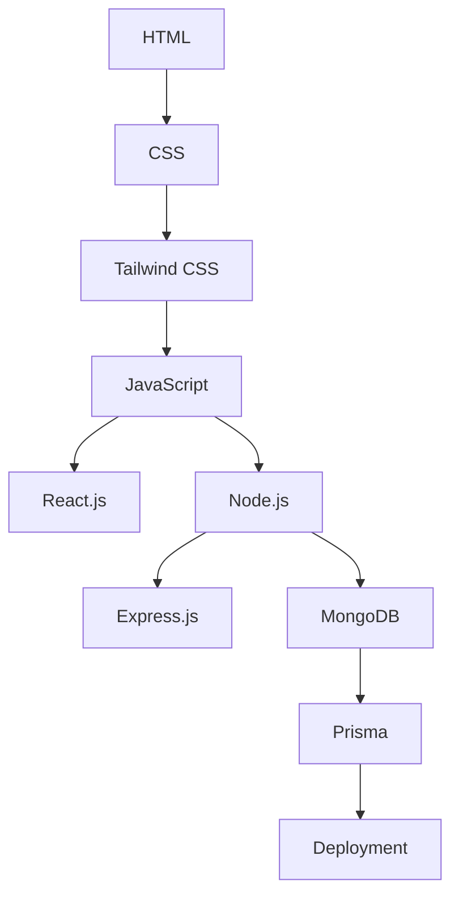

# Web Development Course by Hitesh Choudhary 👨‍💻📚

Welcome to the **Web Development Course Repository**! 🚀 This repository contains all the content and projects I am working on as part of the [Web Development Course](https://www.udemy.com/) by Hitesh Choudhary. It's a comprehensive course covering modern web development tools, technologies, and best practices. I'll update the content daily as I progress. Stay tuned! 🌟

---

## 📋 Course Content Overview

This course covers everything you need to know to become a **Full Stack Web Developer**. Here's a breakdown of the topics:

### Frontend Development 🎨
- **HTML5**: Building the structure of web pages.
- **CSS3**: Styling web pages with animations and layouts.
- **Tailwind CSS**: Utility-first CSS framework for rapid UI development.

### Backend Development 🛠️
- **Node.js**: Server-side JavaScript runtime.
- **Express.js**: Fast and minimalist web framework for Node.js.

### Database Management 🗄️
- **MongoDB**: NoSQL database for modern applications.
- **Prisma**: Next-generation ORM for database operations.

### Modern Frameworks 🖥️
- **React.js**: Build dynamic and interactive UIs.

### Deployment 🚀
- Learn to deploy projects on platforms like **Vercel**, **Netlify**, and **Heroku**.

---

## 🗂️ Folder Structure

```plaintext
web-development-course-Udemy---By-Hitesh-Sir/
├── frontend/          # All frontend development content
├── backend/           # Backend and server-side projects
├── database/          # Database schemas and operations
├── deployment/        # Deployment guides and configurations
└── README.md          # Repository overview
```

---

## 🛠️ Tools and Technologies Used

- **Languages**: HTML, CSS, JavaScript, Node.js
- **Frameworks**: React.js, Express.js
- **Database**: MongoDB with Prisma ORM
- **Version Control**: Git and GitHub
- **Deployment**: Vercel, Netlify, Heroku

---

## 📈 Progress Tracker

| Date         | Topic Covered                            | Status  |
|--------------|------------------------------------------|---------|
| 2024-12-09  | Repository Initialization, README Setup  | ✅      |
| 2024-12-10  | Basics of HTML5 and CSS3                 | ✅🛠️     |
| 2024-12-10  | Js foundation done till basics, datatype,
                operators, conditionals, array & methods,
                functions, js OOP                        | ...     |

---

## 📊 Visual Overview

Here's a visual representation of the course flow:



---

## 🙌 Contributions

Feel free to fork this repository, suggest improvements, or learn along with me! If you spot any mistakes, open an issue or pull request.

---

## 📬 Contact

If you have questions or want to connect:
- **Email**: tarleomkar8@gmail.com
- **LinkedIn**: [Your Profile](https://www.linkedin.com/in/omkar-tarle-686115220/)

---

Happy coding! 💻✨
